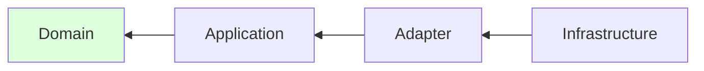
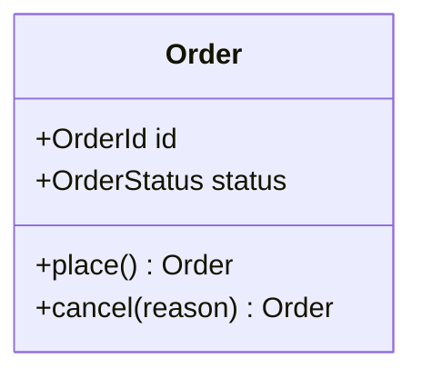
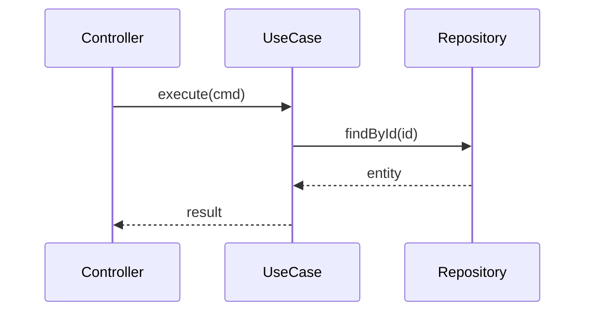
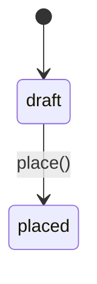
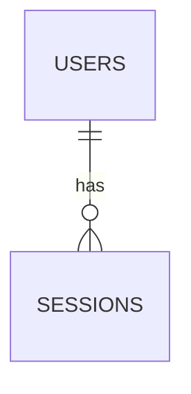

# {제목} 설계서

## 1. 설계 판정

| 항목 | 결정 | 근거 |
|------|------|------|
| DDD 적용 수준 | Level {0~3} | 도메인 복잡도 {n} + 언어 불일치 {n} + 수명 {n} + 팀·모듈 {n} = {합계} |
| 계층 수 | {2 / 4} | |
| 원칙 예외 | {있음 → ADR-{NNNN} / 없음} | |

## 2. 계층 구조

| 계층 | 디렉토리 | 포함 | 의존 허용 |
|------|---------|------|----------|
| Domain | `src/domain/` | 엔티티, 값 객체, 도메인 서비스 | (없음) |
| Application | `src/application/` | 유스케이스, 포트 | Domain |
| Adapter | `src/adapter/` | 컨트롤러, 리포지토리 구현, 매퍼 | Application, Domain |
| Infrastructure | `src/infra/` | ORM, 클라이언트, DI 조립 | 전체 |



화살표는 의존 방향이다. 모든 화살표가 Domain(초록)을 향한다 —
안쪽은 바깥쪽을 알지 못한다.

## 3. 도메인 모델

> DDD Level 2 이상에서 작성. Level 0~1이면 "해당 없음"으로 표기한다.

### 3.1 값 객체

| 이름 | 표현 | 검증 규칙 | 동등성 |
|------|------|----------|--------|
| | | | 값 기준 |

### 3.2 엔티티

| 이름 | 식별자 | 불변식 | 공개 도메인 메서드 |
|------|--------|--------|------------------|
| | | | |

### 3.3 애그리게이트

| 루트 | 포함 | 트랜잭션 단위 | 다른 애그리게이트 참조 |
|------|------|-------------|---------------------|
| | | | ID 참조 |

### 3.4 도메인 이벤트

| 이벤트 | 발생 시점 | 페이로드 | 구독자 |
|--------|----------|---------|--------|
| | | | |



> 다이어그램 설명 3줄 이내. 레이블은 용어집·코드 식별자와 일치해야 한다.

## 4. 유스케이스와 포트

> **구현자가 그대로 쓸 수 있는 수준**으로 적는다. 타입 이름까지 확정한다.

### 4.1 포트 인터페이스

```
interface {PortName}:
    {method}({param}: {Type}) -> {ReturnType}
```

> 시각·난수·ID 생성을 포트로 선언한다 (`Clock`, `IdGenerator`).
> 순수성 원칙의 실질적 구현이며, 없으면 테스트가 불가능해진다.

| 포트 | 메서드 | 구현 위치 | 비고 |
|------|--------|----------|------|
| | | `src/adapter/...` | |

### 4.2 유스케이스

| 유스케이스 | 입력 | 출력 | 의존 포트 | 트랜잭션 |
|-----------|------|------|----------|---------|
| | | | | 예/아니오 |



> 설명 3줄 이내.

## 5. 상태 전이

> **코드의 전이 맵과 1:1 대응해야 한다.** 불일치는 `integration-qa`가 검출한다.

| From | To | 트리거 | 조건 |
|------|-----|--------|------|
| | | | |



> 화살표 레이블은 도메인 메서드명과 일치한다. 여기에 없는 전이는 코드에서 수행할 수 없다.

## 6. 경계면 계약

> **예외 없이 전 항목을 확정한다.** 애매하게 남기면 런타임에 터진다.

| 항목 | 확정 |
|------|------|
| 응답 래핑 | `{data: T}` / `T` (전 엔드포인트 일관) |
| 네이밍 | camelCase / snake_case |
| 변환 지점 | `src/adapter/mapper/` **단 한 곳** |
| 에러 바디 | `{code, message, details?}` |
| 에러 code 목록 | |
| 상태 코드 규칙 | 202/204/409의 의미 |
| null 처리 | `null` 명시 / 키 생략 |
| 날짜·시각 | ISO 8601, UTC |
| 페이지네이션 | 커서 / 오프셋, 메타 필드명 |
| 비동기 | 즉시 응답 타입과 최종 결과 타입을 **별개로** 정의 |

### 6.1 엔드포인트별 계약

> **각 엔드포인트에 실제 응답 예시를 붙인다.** 타입 정의만으로는 소비자가
> 래핑 여부를 오해한다 — 가장 흔한 런타임 오류의 원인이다.

상세는 `docs/design/api-contract-{slug}.md` 참조.

### 6.2 DB ↔ 도메인 매핑

| 테이블.컬럼 | 도메인 필드 | 타입 변환 | null |
|------------|-----------|----------|------|
| | | | |



> 설명 3줄 이내.

## 7. 아키텍처 검증 규칙

> A1~A4는 필수. 나머지는 해당 요소가 존재할 때 추가한다.

| # | 규칙 | 적용 | 구현 위치 |
|---|------|------|----------|
| A1 | Domain이 외부 계층을 import하지 않는다 | ✔ | `tests/architecture/` |
| A2 | Application이 Infra 구체 타입에 의존하지 않는다 | ✔ | |
| A3 | Domain에 프레임워크 어노테이션이 없다 | ✔ | |
| A4 | 계층 간 순환 의존이 없다 | ✔ | |
| A5~A9 | | | |

## 8. 승인된 원칙 예외

| 예외 | ADR | allowlist 위치 | 되돌리는 조건 |
|------|-----|--------------|-------------|
| | | | |

## 9. 구현 지침

| 항목 | 지침 |
|------|------|
| 디렉토리 배치 | §2 계층 배치표를 따른다 |
| 명명 | §10 용어집을 따른다 |
| 테스트 배치 | |
| 기존 코드 접점 | ACL(부패 방지 계층) 위치 |

## 10. 용어집

> DDD Level 1 이상에서 필수. 코드·DB·API가 모두 이 표를 따른다.

| 용어 | 정의 | 코드 식별자 | 폐기된 표현 |
|------|------|-----------|-----------|
| | | | |
