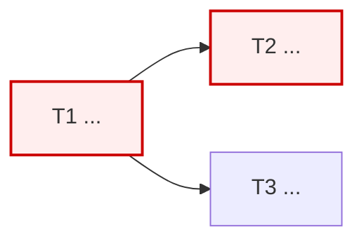

# {제목} WBS · CPM · Task

## 1. 요약

| 항목 | 값 |
|------|-----|
| Task 총 수 | |
| 임계 경로 길이 | |
| 병렬 라운드 수 | |
| 필요 역할 | |
| 추정 단위 | 인시 / 인일 / 포인트 |

## 2. WBS

> **100% 규칙:** 하위의 합 = 상위의 전부. 빠진 것도 범위 밖 것도 없다.
> 모든 리프는 Task가 된다.

```
1. {상위 작업}
   1.1 {하위}          → T1
   1.2 {하위}          → T2
2. {상위 작업}
   2.1 {하위}          → T3
```

## 3. CPM

| ID | Task | 선행 | O | M | P | 기대 | ES | EF | LS | LF | Float | 임계 |
|----|------|------|---|---|---|------|----|----|----|----|-------|------|
| T1 | | - | | | | | 0 | | 0 | | 0 | ★ |

기대값 = `(O + 4M + P) / 6`  ·  Float = `LS − ES`  ·  Float 0 = 임계 경로

### 3.1 임계 경로



임계 경로: T1 → T2 → ... 붉은 노드가 지연되면 전체 일정이 그만큼 밀린다.
Float가 있는 Task는 그만큼 늦춰도 전체에 영향이 없다.

## 4. 병렬 라운드

> 구현 팀 구성의 근거. 한 번도 등장하지 않는 역할은 팀에 넣지 않는다.

| 라운드 | 동시 착수 가능 Task | 필요 역할 |
|--------|-------------------|----------|
| 1 | | |
| 2 | | |

## 5. Task 명세

> 담당이 **컨텍스트 없이 착수 가능**해야 한다.
> 범위 밖을 명시하는 것이 범위를 명시하는 것만큼 중요하다.

### T{N} — {제목}

- **담당 역할**: {agent}
- **선행**: {T…}
- **목적**: {한 문장}
- **범위**: {디렉토리·모듈}
- **범위 밖**: {다른 Task가 담당하는 것}
- **참조**: tech-spec §{N}, ADR-{NNNN}, design §{N}
- **완료 조건**:
  - [ ] 
  - [ ] 대응 테스트 존재 및 통과
  - [ ] 아키텍처 검증 {A…} 통과
- **추정**: O={} M={} P={}

## 6. 리스크 대응 Task

> 개발분석의 심각도 높음 리스크는 Task로 존재해야 한다.
> 문서에만 적고 Task로 만들지 않으면 아무도 대응하지 않는다.

| 리스크 ID | 대응 Task | 배치 라운드 |
|----------|----------|-----------|
| R1 | T{N} | |

## 7. 추정 근거와 신뢰도

| Task | 추정 근거 | 신뢰도 |
|------|----------|--------|
| | | 높음 / 중간 / **낮음** |

## 8. 가정과 제외

| 항목 | 내용 |
|------|------|
| 추정에 포함된 것 | 구현 + 테스트 작성 + 셀프 리뷰 |
| 추정에서 제외된 것 | 리뷰 대기 시간, 환경 구축, 외부 의존 대기 |
| 전제 | |
