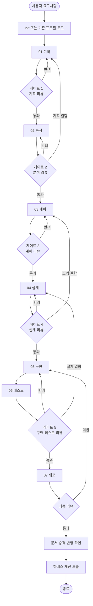

# 파이프라인 정의

하네스가 운영하는 개발 파이프라인의 **도구 중립 정의**. 단계, 게이트, 롤백 규칙,
산출물 계약을 기술한다. 특정 코딩 에이전트의 실행 방식은 `adapters/`에서 다룬다.

먼저 [실행 규약](runtime.md)을 따른다. 시작 시 harness-init으로 프로젝트 프로필을
설정하고, 모든 판정은 작업의 유효 설정과 프로젝트 추가 규칙을 적용한다.
본문의 수치 예시는 기본값이며 설정을 덮어쓰지 않는다.

## 목차

1. [전체 흐름](#1-전체-흐름)
2. [단계 정의](#2-단계-정의)
3. [리뷰 게이트](#3-리뷰-게이트)
4. [롤백 규칙](#4-롤백-규칙)
5. [단계 건너뛰기](#5-단계-건너뛰기)
6. [최종 리뷰와 하네스 개선](#6-최종-리뷰와-하네스-개선)

---

## 1. 전체 흐름



**핵심 성질:**
- 게이트는 **되돌아갈 수 있다.** 결함의 근원 단계로 롤백한다 (4절).
- 구현(05)과 테스트(06) 사이에는 게이트가 없다. 두 단계는 한 묶음으로 검증된다.
- 배포(07)는 사용자가 요구할 때만 수행한다 (5절).

## 2. 단계 정의

각 단계는 **입력 계약 → 담당 → 산출물 계약 → 완료 조건**으로 정의된다.
완료 조건을 만족하지 못하면 게이트에 진입하지 않는다.

### 01 기획 (Planning)

| 항목 | 내용 |
|------|------|
| 입력 | 사용자의 자연어 요구사항 |
| 담당 | `planner-interviewer` (사용자 대화 필수) |
| 산출물 | `_workspace/{slug}/01_planning/prd-draft.md` |
| 완료 조건 | PRD 템플릿의 모든 필수 섹션이 채워짐. 미결정 항목이 명시됨. 사용자가 PRD 내용을 확인함 |

**이 단계는 사용자와의 대화 없이 완료할 수 없다.** 요구사항의 공백을
추측으로 메우면 이후 모든 단계가 잘못된 전제 위에 쌓인다.
질문은 한 번에 몰아서 하되, 답이 다른 답에 의존하면 라운드를 나눈다.

### 02 분석 (Analysis)

두 갈래를 **병렬로** 수행한다.

| 갈래 | 담당 | 목적 | 산출물 |
|------|------|------|--------|
| 기획분석 | `research-analyst` | PRD를 완성·검증하기 위한 근거 수집 (코드베이스, repo 문서, 웹 리서치) | `02_analysis/*_research-analyst_*.md` |
| 개발분석 | `codebase-analyst` | 구현 관점의 현황·제약·리스크 분석 | `02_analysis/*_codebase-analyst_*.md` |

| 항목 | 내용 |
|------|------|
| 입력 | `01_planning/prd-draft.md` |
| 완료 조건 | 리스크가 심각도·발생 가능성과 함께 목록화됨. PRD의 미결정 항목마다 근거 또는 "정보 부족" 판정이 붙음 |

### 03 계획 (Plan)

| 항목 | 내용 |
|------|------|
| 입력 | PRD + 분석 결과 |
| 담당 | `tech-spec-writer` → `wbs-planner` (순차) |
| 산출물 | `03_plan/tech-spec.md`, `03_plan/adr/ADR-*.md`, `03_plan/wbs.md`, `03_plan/tasks.md` |
| 완료 조건 | 모든 결정 항목이 Tech Spec에 반영되거나 ADR로 분리됨. WBS의 모든 리프가 Task로 변환됨. CPM 임계 경로가 산출됨. **ADR이 사용자에게 보고되고 승인됨** |

**Task 크기 기준:** 하나의 Task = 하나의 PR. 코드 리뷰가 용이한 규모.
판정 기준은 `wbs-cpm-planning` 스킬 참조.

### 04 설계 (Design)

| 항목 | 내용 |
|------|------|
| 입력 | Tech Spec + ADR + WBS |
| 담당 | `architect` |
| 산출물 | `04_design/design.md`, `04_design/diagrams/*.md`, `04_design/api-contract.md`, `04_design/glossary.md`(DDD Level 1+) |
| 완료 조건 | 계층 구조와 의존 방향이 명시됨. 모든 경계면 계약이 확정됨. DDD 적용 수준이 판정·기록됨. 아키텍처 검증 규칙(A1~A4 최소)이 선정됨 |

### 05 구현 (Implement)

| 항목 | 내용 |
|------|------|
| 입력 | 설계서 + Task 목록 |
| 담당 | 영역별 구현 에이전트 6종 + `qa-inspector`(점진 검증) |
| 산출물 | 실제 코드 + 테스트 코드 + `05_implement/impl-notes-*.md` |
| 완료 조건 | 모든 Task가 완료됨. **모든 프로덕션 코드에 대응 테스트가 존재함.** 아키텍처 검증 테스트가 추가됨. 프론트엔드가 있으면 E2E가 silent로 구성됨 |

**점진 QA:** 각 모듈 완성 직후 `qa-inspector`가 경계면 교차 검증을 수행한다.
전체 완성 후 일괄 검증은 결함 전파를 막지 못한다.

### 06 테스트 (Test)

| 항목 | 내용 |
|------|------|
| 입력 | 구현된 코드 + 테스트 코드 |
| 담당 | `test-engineer` |
| 산출물 | `06_test/test-report.md` 원본, `docs/test/test-report.md` 최신 사본, `06_test/raw/*` |
| 완료 조건 | 필수 테스트가 실행되고 실패 0건. 유효 커버리지 기준 충족 또는 예외 근거. 필수 영역 미실행은 INCOMPLETE로 보류 |

### 07 배포 (Deploy)

| 항목 | 내용 |
|------|------|
| 입력 | 검증된 코드 + 사용자의 배포 요구 조건 |
| 담당 | `devops-engineer` |
| 산출물 | CI/CD 설정 파일 + `08_deploy/cicd-notes.md` |
| 완료 조건 | 파이프라인이 정의됨. 시크릿 취급 방식이 명시됨. 롤백 절차가 문서화됨 |

**사용자가 배포 조건을 제시하지 않으면 이 단계는 건너뛴다.** 임의로
플랫폼을 선택해 CI/CD를 구축하지 않는다.

## 3. 리뷰 게이트

### 게이트 구성

| 게이트 | 시점 | 검토자 | 주 검토 대상 |
|--------|------|--------|-------------|
| G1 | 기획 후 | `doc-reviewer` | PRD 완전성·모호성·검증 가능성 |
| G2 | 분석 후 | `doc-reviewer` | 근거 충분성, 리스크 누락 |
| G3 | 계획 후 | `doc-reviewer` | Tech Spec ↔ PRD 추적성, ADR 타당성, Task 크기 |
| G4 | 설계 후 | `doc-reviewer` + `architect`(자기 검토 제외) | 아키텍처 원칙 준수, 경계면 계약 완전성 |
| G5 | 구현·테스트 후 | `code-reviewer` + `qa-inspector` | 코드 품질, 원칙 준수, 통합 정합성, 테스트 충분성 |
| G6 | 배포 후 (최종) | `code-reviewer` + `doc-reviewer` | 전 단계 산출물 일관성, 요구사항 충족 |

### 판정 형식

게이트 결과는 `_workspace/{slug}/99_gate/gate-{stage}-r{N}.md`에 기록한다.

```markdown
# 게이트 판정: {stage} (라운드 {N})

**판정:** PASS | REJECT
**롤백 대상:** (REJECT 시) {stage}

## 지적 사항

| # | 심각도 | 위치 | 내용 | 조치 요구 |
|---|--------|------|------|----------|
| 1 | BLOCKER | prd-draft.md §3 | 성공 지표가 측정 불가능한 표현 | 정량 지표로 재작성 |
| 2 | MAJOR | prd-draft.md §5 | 오프라인 시나리오 미정의 | 범위 포함/제외 명시 |
| 3 | MINOR | prd-draft.md §2 | 용어 혼용 ("회원"/"사용자") | 용어 통일 |

## 판정 근거
BLOCKER 1건 존재 → REJECT
```

### 심각도와 판정 규칙

| 심각도 | 정의 | 판정 영향 |
|--------|------|----------|
| **BLOCKER** | 이후 단계를 잘못된 전제 위에 쌓게 만듦 | gate.blocker_rejects 이상이면 REJECT |
| **MAJOR** | 재작업 비용이 크지만 진행은 가능 | gate.major_rejects 이상이면 REJECT |
| **MINOR** | 개선 권고 | 판정에 영향 없음. 기록만 |

### 재시도 한계

같은 게이트에서 연속 REJECT 횟수가 **gate.max_retries에 도달**하면 자동 재작업을 중단하고 사용자에게
보고한다. 반복 반려는 상위 단계(요구사항·설계)의 결함이거나 판정 기준이
비현실적이라는 신호다.

```markdown
게이트 {stage}가 설정 한계 {gate.max_retries}회 연속 반려되었습니다.

반복 지적: {가장 자주 나온 지적}
추정 원인: {상위 단계 결함 | 기준 과도 | 정보 부족}

선택지:
1. {상위 단계}로 롤백하여 근본 원인 수정
2. 해당 지적을 예외로 승인하고 진행 (ADR 기록)
3. 판정 기준 조정
```

## 4. 롤백 규칙

REJECT 시 **결함이 발생한 단계**로 돌아간다. 직전 단계로 기계적으로
돌아가는 것이 아니다.

| 지적의 성격 | 롤백 대상 |
|-----------|----------|
| 요구사항 자체가 모호/누락 | 01 기획 |
| 근거·리스크 조사 부족 | 02 분석 |
| 기술 선택·일정·Task 분해 오류 | 03 계획 |
| 계층 구조·경계면 계약 오류 | 04 설계 |
| 설계는 맞으나 코드가 어긋남 | 05 구현 |
| 테스트 부족·실패 | 05 구현 (테스트도 구현의 일부) |

**롤백 시 하위 단계 산출물의 취급:**
- 삭제하지 않는다. `_workspace`에 그대로 두고 재작업 결과로 덮어쓴다
- 롤백된 단계보다 하위 단계는 `state.json`에서 `pending`으로 되돌린다
- `walkthrough.md`에 롤백 사유와 영향 범위를 기록한다

**롤백 전파 확인:** 상위 단계를 고치면 하위 산출물이 무효화될 수 있다.
재작업 시 해당 에이전트는 하위 산출물과의 불일치를 반드시 점검하고
영향받는 항목을 보고한다.

## 5. 단계 건너뛰기

작업 성격과 프로필에 따라 경로를 선택하고 `walkthrough.md`에 기록한다.
사용자가 이미 정하거나 위임한 범위는 재승인받지 않는다. 범위가 달라질 때만 제안한다.

| 작업 유형 | 권장 경로 |
|----------|----------|
| 신규 기능 개발 | 전체 (01~07) |
| 버그 수정 | 02 분석(개발분석만) → 05 구현 → 06 테스트 → G5 |
| 리팩터링 | 02 분석 → 04 설계 → 05 구현 → 06 테스트 → G5 |
| 문서화만 | 02 분석 → G2 |
| 기존 기능 확장 | 01 기획(간소) → 02 분석 → 03 계획 → 04 설계 → 05~06 |
| CI/CD 구축만 | 07 배포 |

**생략할 수 없는 것:**
- 코드가 변경되면 **05 구현의 테스트 요구**와 **06 테스트**는 생략 불가
- 코드 변경 작업의 게이트 G5는 생략 불가

## 6. 최종 리뷰와 하네스 개선

### 최종 리뷰 (G6)

전 단계 산출물의 **일관성**을 검증한다. 개별 단계 리뷰에서 통과한 항목도
전체 맥락에서는 어긋날 수 있다.

체크 항목:
- PRD의 모든 요구사항이 Task로 추적되고 구현되었는가 (요구사항 추적 매트릭스)
- 설계서의 모든 경계면 계약이 코드에서 지켜지는가
- ADR의 결정이 코드에 반영되었는가
- 테스트 리포트가 최신 코드 기준인가
- 승격 후보의 내용과 대상 경로가 확정되었는가 (실제 반영은 G6 이후 확인)

### 하네스 개선 도출

작업 완료 시 오케스트레이터는 **이번 실행에서 관찰된 하네스 자체의 문제**를
도출하여 사용자에게 제시한다. 결과물의 개선이 아니라 **프로세스의 개선**이다.

수집 신호:
- 특정 게이트에서 반복 반려 → 해당 단계 스킬의 기준이 불명확
- 에이전트가 스킬 없이 즉흥적으로 작업 → 스킬 누락 또는 트리거 실패
- 사용자가 같은 지적을 2회 이상 반복 → 원칙/스킬에 미반영
- 단계 간 산출물 형식 불일치 → 템플릿 결함
- 예상보다 오래 걸린 단계 → 분해 또는 병렬화 필요

제시 형식:

```markdown
## 하네스 개선 제안

| # | 관찰 | 제안 | 대상 파일 |
|---|------|------|----------|
| 1 | G4가 2회 반려 — 모두 "경계면 계약 누락" | 설계 완료 조건에 경계면 체크리스트 추가 | `skills/architecture-design/SKILL.md` |
| 2 | 구현 중 DB 마이그레이션 순서 혼선 | DB 플레이북에 마이그레이션 절차 추가 | `skills/implementation-playbook/references/database.md` |

적용할까요? (번호 선택 / 전체 / 없음)
```

프로젝트별 개선은 `.harness/rules.md`와 context.md에 기록한다.
공통 개선은 제안으로 남기며, 플러그인 소스 수정 요청이 있을 때 소스에 반영한다.
설치된 플러그인 캐시는 수정하지 않는다.
