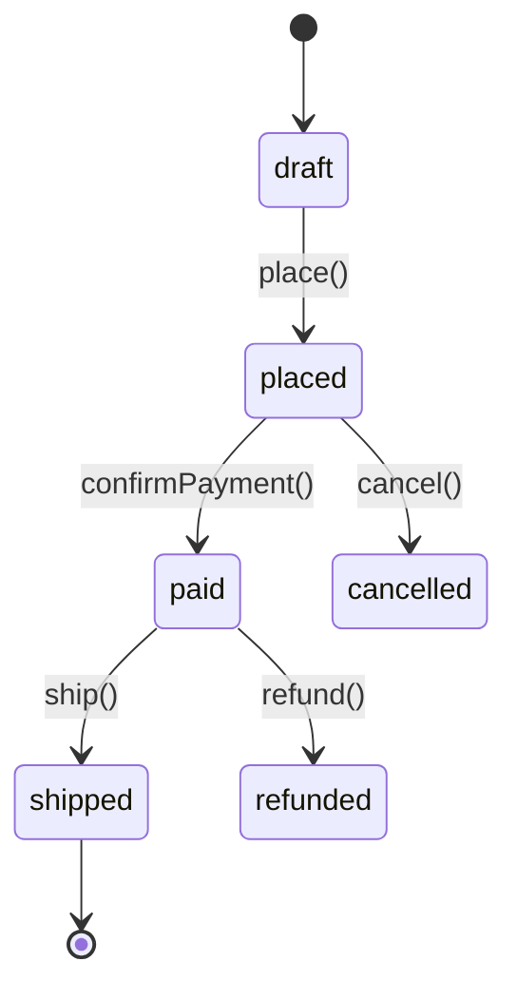

# 문서 규약

모든 정식 문서는 `/docs/` 하위에 위치한다. 작업 중간 산출물은 `/_workspace/`에
기록하며(`workspace.md` 참조), 지속 참조가 필요한 것만 **승격**하여 `/docs/`로 옮긴다.

## 목차

1. [디렉토리 구조와 소유](#1-디렉토리-구조와-소유)
2. [파일 명명 규칙](#2-파일-명명-규칙)
3. [문서 공통 형식](#3-문서-공통-형식)
4. [덮어쓰기 vs 누적](#4-덮어쓰기-vs-누적)
5. [승격 절차](#5-승격-절차)
6. [다이어그램 규약](#6-다이어그램-규약)

---

## 1. 디렉토리 구조와 소유

```
docs/
├── template/    문서 템플릿 (모든 단계에서 참조)
├── prd/         기획 산출물 — PRD, 용어 정의, 사용자 스토리
├── plan/        계획 산출물 — Technical Spec, ADR, WBS, CPM, Task 목록
│   └── adr/     ADR 개별 파일
├── design/      설계 산출물 — 아키텍처 설계서, 도메인 모델, 시퀀스, 스키마, API 계약
├── implement/   구현 산출물 — 구현 노트, 모듈 가이드, 경계면 계약 확정본
├── test/        테스트 산출물 — 테스트 계획, 테스트 리포트, 커버리지 리포트
├── review/      리뷰 산출물 — 단계별 리뷰 결과, 최종 리뷰
└── report/      보고 산출물 — 진행 보고, 완료 보고, 하네스 개선 제안
```

| 디렉토리 | 주 생산자 에이전트 | 대표 산출물 |
|---------|-----------------|-----------|
| `prd/` | planner-interviewer | `prd-{slug}.md` |
| `plan/` | tech-spec-writer, wbs-planner | `tech-spec-{slug}.md`, `wbs-{slug}.md`, `adr/ADR-NNNN-*.md` |
| `design/` | architect | `design-{slug}.md`, `glossary.md`, `api-contract-{slug}.md` |
| `implement/` | 구현 에이전트 6종 | `impl-notes-{slug}.md` |
| `test/` | test-engineer | `test-report.md`, `test-plan-{slug}.md` |
| `review/` | doc-reviewer, code-reviewer, qa-inspector | `review-{stage}-{slug}.md` |
| `report/` | sdlc-orchestrator | `completion-{slug}.md`, `harness-improvement-{slug}.md` |

## 2. 파일 명명 규칙

```
{종류}-{slug}.md              일반 문서
{종류}-{stage}-{slug}.md      단계가 있는 문서
ADR-{NNNN}-{slug}.md          ADR (4자리 일련번호, 전역 증가)
```

- **slug**: 작업 단위를 식별하는 kebab-case 문자열. 하나의 작업(PRD → 배포)이
  같은 slug를 공유하여 문서 간 추적이 가능하다. 예: `user-auth`, `order-checkout`
- 날짜를 파일명에 넣지 않는다. 날짜는 문서 frontmatter에 기록한다.
  파일명에 날짜가 있으면 참조 링크가 갱신마다 깨진다.
- 예외: `test-report.md`는 slug 없이 단일 파일로 유지하고 매번 덮어쓴다 (4절).

## 3. 문서 공통 형식

모든 정식 문서는 YAML frontmatter로 시작한다.

```yaml
---
title: 사용자 인증 PRD
slug: user-auth
stage: prd            # prd | plan | design | implement | test | review | report
status: draft         # draft | reviewed | approved | superseded
version: 1.2
created: 2026-08-14
updated: 2026-08-16
authors: [planner-interviewer]
related:
  - docs/design/design-user-auth.md
  - docs/plan/adr/ADR-0003-session-storage.md
---
```

**작성 원칙:**
- 사람과 AI가 **모두** 읽는다. 표·목록·다이어그램을 우선하고 서술형 장문을 피한다.
- 결론을 먼저 쓴다. 근거는 뒤에 둔다.
- 미결정 사항은 삭제하지 말고 `> **[미결정]** 내용 — 결정 필요 시점: ...` 형태로 남긴다.
- 다른 문서를 참조할 때는 **저장소 루트 기준 상대 경로**를 쓴다 (`docs/design/...`).

## 4. 덮어쓰기 vs 누적

| 문서 | 정책 | 이유 |
|------|------|------|
| `test/test-report.md` | **덮어쓰기** | 최신 테스트 결과만 의미가 있다. 이력은 CI 아티팩트에 남는다 |
| `report/` 진행 보고 | **덮어쓰기** | 현재 상태를 나타낸다 |
| PRD, Tech Spec, 설계서 | **버전 증가 후 갱신** | frontmatter `version` + `updated` 갱신. 본문은 최신 상태 유지 |
| ADR | **불변** | 결정을 뒤집을 때는 새 ADR을 만들고 이전 ADR을 `status: superseded`로 변경 |
| 리뷰 결과 | **누적** | 게이트 통과 이력이 감사 근거가 된다. `review-{stage}-{slug}-r{N}.md` |

## 5. 승격 절차

`/_workspace/`는 `.gitignore`에 포함되어 커밋되지 않는다. 따라서 이후에도
계속 참조해야 하는 내용은 반드시 `/docs/`로 승격해야 한다.

### 승격 대상 판정

| 승격한다 | 승격하지 않는다 |
|---------|---------------|
| 향후 구현·운영의 근거가 되는 결정 | 중간 탐색 로그, 시행착오 기록 |
| 외부(사람·다른 에이전트)가 참조할 계약·스펙 | 에이전트 간 임시 메모 |
| 재현이 어려운 분석 결과 | 재실행하면 다시 얻을 수 있는 산출물 |
| 리뷰에서 승인된 산출물 | 반려된 초안 |

### 절차

1. 오케스트레이터가 단계 종료 시 `_workspace/` 산출물 중 승격 후보를 선별한다
2. **후보 목록을 사용자에게 제시하고 승인을 요청한다** — 자동 승격 금지
3. 승인된 문서만 템플릿(`docs/template/`)에 맞춰 재작성하여 `/docs/` 하위에 배치한다
   - 원문 복사가 아니라 **템플릿 형식으로 정리**한다. `_workspace` 산출물은 작업 로그,
     `/docs` 문서는 참조용 자산이므로 형식과 밀도가 다르다
4. `_workspace/walkthrough.md`에 승격 결과를 기록한다 (원본 → 승격 경로)

### 사용자 제시 형식

```markdown
## 승격 후보 (기획 단계)

| # | 원본 | 제안 경로 | 사유 |
|---|------|----------|------|
| 1 | `_workspace/user-auth/01_planning/prd-draft.md` | `docs/prd/prd-user-auth.md` | 이후 모든 단계의 기준 문서 |
| 2 | `_workspace/user-auth/01_planning/interview-log.md` | (승격 안 함) | 재현 가능한 대화 로그 |

승격을 진행할까요? (번호로 선택 / 전체 / 없음)
```

## 6. 다이어그램 규약

> **다이어그램은 AI가 파싱하고 사람이 읽을 수 있어야 한다.**
> 따라서 이미지가 아니라 **텍스트 기반 다이어그램**을 사용한다.

### 기본 도구: Mermaid

Markdown 코드 펜스 안에 작성한다. GitHub·대부분의 뷰어·Artifact에서 렌더링되며,
렌더링되지 않는 환경에서도 소스가 그대로 읽힌다.

| 용도 | Mermaid 다이어그램 |
|------|------------------|
| 계층/모듈 의존 관계 | `flowchart` |
| 유스케이스 흐름, API 호출 순서 | `sequenceDiagram` |
| 상태 전이 | `stateDiagram-v2` |
| 도메인 모델, 애그리게이트 관계 | `classDiagram` |
| DB 스키마 | `erDiagram` |
| WBS/일정, CPM 임계 경로 | `gantt` |
| 배포 파이프라인 | `flowchart LR` |

### 작성 규칙

1. **노드 레이블은 유비쿼터스 언어를 따른다** — 다이어그램과 코드의 이름이 같아야 한다
2. **한 다이어그램에 한 관점만** 담는다. 흐름과 구조를 섞지 않는다
3. 노드가 15개를 넘으면 분할한다. 읽히지 않는 다이어그램은 없는 것과 같다
4. 다이어그램 **바로 아래에 3줄 이내 설명**을 붙인다 — 렌더링 실패 시의 대비이자
   AI가 의도를 파악하는 단서다
5. 상태 전이 다이어그램은 코드의 전이 맵과 **1:1 대응**해야 한다.
   불일치는 `integration-qa`에서 결함으로 검출된다



주문 애그리게이트의 상태 전이. 화살표 레이블은 도메인 메서드명과 일치한다.
여기에 없는 전이는 코드에서 수행할 수 없다.
