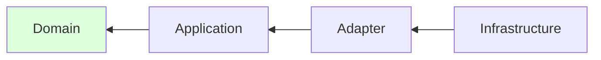

# Architecture Design — 아키텍처 및 도메인 설계

## 목적

**구현자가 판단할 여지를 최소화하는 설계**를 만든다. 설계서를 읽은 구현 에이전트가
"어디에 무엇을 어떤 시그니처로" 만들지 즉시 알아야 한다.

## 선행 로드

설계 시작 전 반드시 읽는다:
- `harness/principles/architecture.md` — 의존성 규칙, 계층, SOLID, 순수성
- `harness/principles/ddd.md` — 적용 수준 판정, 전략·전술 패턴

원칙은 암기 대상이 아니라 매 설계마다 참조하는 규범이다.

## 절차

### 1. DDD 적용 수준 판정 (가장 먼저)

`ddd.md` 1절의 판정표로 Level 0~3을 정한다. 판정 근거를 설계서 서두에 기록한다.

**"일단 Level 3으로 시작"은 금지한다.** 필요해지면 올린다. 과설계는
원칙 준수가 아니라 낭비다.

### 2. 계층 구조 확정

`architecture.md` 2절. 규모에 맞춰 계층 수를 정한다.

| 프로젝트 성격 | 계층 |
|-------------|------|
| 단순 CRUD, 도메인 규칙 거의 없음 | 2계층 (Application + Infra) |
| 도메인 규칙이 있는 일반 서비스 | 4계층 |
| 복수 컨텍스트, 대규모 | 4계층 + 컨텍스트별 모듈 |

**계층 배치표를 반드시 작성한다:**

| 계층 | 디렉토리 | 포함 | 의존 허용 |
|------|---------|------|----------|
| Domain | `src/domain/` | 엔티티, 값 객체, 도메인 서비스 | (없음) |
| Application | `src/application/` | 유스케이스, 포트 | Domain |
| Adapter | `src/adapter/` | 컨트롤러, 리포지토리 구현, 매퍼 | Application, Domain |
| Infrastructure | `src/infra/` | ORM, 클라이언트, DI 조립 | 전체 |

계층 축소를 결정했다면 **ADR로 기록**한다.

### 3. 도메인 모델 설계 (Level 2 이상)

순서: **값 객체 → 엔티티 → 애그리게이트 → 도메인 서비스 → 도메인 이벤트**

값 객체부터 시작하는 이유: 투자 대비 효과가 가장 크고, 나머지 설계의 어휘가 된다.

각 요소마다 명시할 것:

| 요소 | 명시 |
|------|------|
| 값 객체 | 생성 시 검증 규칙, 동등성 기준 |
| 엔티티 | 식별자, **불변식**, 공개 도메인 메서드 (setter 아님) |
| 애그리게이트 | 루트, 경계에 포함되는 것, 트랜잭션 단위 |
| 도메인 서비스 | 왜 엔티티에 못 넣는지의 이유 |
| 도메인 이벤트 | 과거형 이름, 페이로드 |

**애그리게이트 경계 판정:** *"A를 바꿀 때 B가 즉시 일관되지 않으면 업무 규칙이
깨지는가?"* Yes면 같은 애그리게이트, No면 ID 참조 + 이벤트.

### 4. 유스케이스와 포트 시그니처

**구현자가 그대로 쓸 수 있는 수준**으로 적는다. 타입 이름까지 확정한다.

```
interface SessionRepository:
    save(session: Session) -> None
    findById(id: SessionId) -> Session | None
    deleteExpired(now: Instant) -> int

usecase LoginUseCase:
    execute(cmd: LoginCommand) -> LoginResult | AuthError
    depends: UserRepository, SessionRepository, Clock, PasswordHasher
```

**시각·난수·ID 생성을 포트로 선언한다** (`Clock`, `IdGenerator`).
순수성 원칙의 실질적 구현이며, 이것이 없으면 테스트가 불가능해진다.

### 5. 경계면 계약 확정 (예외 없이)

경계면 불일치는 런타임 장애의 최대 원인이다. **애매하게 남기지 않는다.**

| 경계면 | 확정할 것 |
|--------|----------|
| API 응답 | 래핑 여부 (`{data: T}` vs `T`) — **전 엔드포인트 일관** |
| 네이밍 | camelCase / snake_case. **변환 지점은 단 한 곳** |
| 에러 바디 | `{code, message, details?}` 형태 + code 목록 |
| 상태 코드 | 각 코드의 의미. 202/204/409 사용 규칙 |
| null 처리 | 옵셔널 부재 표현 (`null` vs 키 생략) |
| 날짜·시각 | 형식(ISO 8601)과 타임존 |
| 페이지네이션 | 커서 vs 오프셋, 메타 필드명 |
| 비동기 | **즉시 응답(202) 타입과 최종 결과 타입을 별개로 정의** |
| DB ↔ 도메인 | 컬럼명 ↔ 필드명 매핑 표 |
| 상태 전이 | 허용 전이 목록 — 이외 전이는 코드에서 불가 |

**각 엔드포인트에 실제 응답 예시를 붙인다.** 타입 정의만으로는 소비자가
래핑 여부를 오해한다 — 실제로 가장 흔한 런타임 오류다.

### 6. 다이어그램 (Mermaid, 최소 4종)

`harness/principles/documentation.md` 6절의 규약을 따른다.
**각 다이어그램 아래 3줄 이내 설명 필수.**

| 다이어그램 | 타입 | 목적 |
|-----------|------|------|
| 계층 의존도 | `flowchart` | 의존 방향이 안쪽을 향함을 시각적으로 증명 |
| 유스케이스 흐름 | `sequenceDiagram` | 계층 간 호출 순서 |
| 상태 전이 | `stateDiagram-v2` | **코드의 전이 맵과 1:1 대응** |
| 데이터 모델 | `classDiagram` / `erDiagram` | 도메인 모델 / DB 스키마 |



화살표는 의존 방향이다. 모든 화살표가 Domain(초록)을 향한다 —
안쪽은 바깥쪽을 알지 못한다.

**노드가 15개를 넘으면 분할한다.** 읽히지 않는 다이어그램은 없는 것과 같다.
**노드 레이블은 용어집·코드 식별자와 일치**해야 한다.

### 7. 아키텍처 검증 규칙 선정

`architecture.md` 7절의 A1~A9 중 이 프로젝트에 적용할 것을 선정한다.
**A1~A4는 필수.** 나머지는 해당 요소가 존재할 때 추가.

선정 결과를 설계서에 표로 남긴다. `architecture-guard` 스킬이 이것을
테스트로 구현한다.

## 산출물

| 파일 | 내용 |
|------|------|
| `_workspace/{slug}/04_design/design.md` | 설계서 본문 |
| `_workspace/{slug}/04_design/api-contract.md` | 경계면 계약 + 실제 응답 예시 |
| `_workspace/{slug}/04_design/glossary.md` | 용어집 (DDD Level 1 이상) |

템플릿: `docs/template/design.md`

## 자주 발생하는 설계 결함

| 결함 | 증상 | 교정 |
|------|------|------|
| 계층은 나눴는데 의존이 역방향 | 도메인이 ORM 어노테이션 사용 | ORM 엔티티 ↔ 도메인 엔티티 분리 + 매퍼 |
| 포트가 구현에 맞춰 설계됨 | `findByEmailAndStatusAndCreatedAfter` | 유스케이스 관점 인터페이스로 재설계 |
| 경계면이 "적당히" 남음 | "JSON으로 반환" | shape·필드명·에러 형태를 못 박는다 |
| 상태 전이가 문서에만 존재 | 다이어그램과 코드가 별개 | 전이 맵을 코드 상수로 두고 검증 테스트 추가 |
| 빈혈 도메인 모델 | 엔티티에 getter/setter만 | 불변식과 전이를 엔티티로 이동 |
| 규모 대비 과설계 | CRUD에 애그리게이트+이벤트 | DDD Level 하향, ADR 기록 |

## 재실행 시

기존 `design.md`를 읽고 게이트 지적 항목만 수정한다.
계층 구조 변경처럼 파급이 큰 수정 시 **영향받는 Task 목록을 함께 보고**한다.

## 완료 판정

- [ ] DDD 적용 수준이 판정되고 근거가 기록되었다
- [ ] 계층 배치표가 있고 의존 방향이 안쪽을 향한다
- [ ] 포트 인터페이스가 시그니처 수준으로 확정되었다
- [ ] 시각·난수·ID가 포트로 선언되었다
- [ ] 경계면 계약이 모두 확정되었다 (표의 전 항목)
- [ ] 각 엔드포인트에 실제 응답 예시가 있다
- [ ] 상태 전이 맵이 있고 다이어그램과 일치한다
- [ ] 다이어그램 4종이 있고 각각 설명이 붙었다
- [ ] 아키텍처 검증 규칙이 선정되었다 (A1~A4 최소)
- [ ] 원칙 예외가 있다면 ADR로 기록되었다
