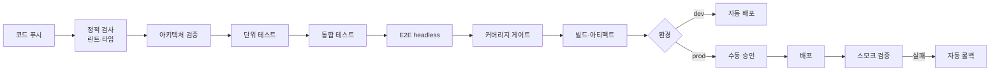

# CI/CD Setup — 파이프라인 구축

플랫폼별 문법은 `references/`에서 필요한 것만 로드한다.

| 플랫폼 | reference |
|--------|----------|
| GitHub Actions | `references/github-actions.md` |
| GitLab CI | `references/gitlab-ci.md` |
| Jenkins | `references/jenkins.md` |

## 최우선 원칙

> **사용자가 배포 조건을 제시하지 않으면 이 단계를 건너뛴다.**

플랫폼·전략을 임의로 선택해 파이프라인을 만들지 않는다.
잘못된 전제로 만든 파이프라인은 쓰이지 않고, 잘못 실행되면 위험하다.

## 절차

### 1. 조건 확인

불명확한 항목을 사용자에게 **묻는다.**

| 항목 | 확인 내용 |
|------|----------|
| 플랫폼 | GitHub Actions / GitLab CI / Jenkins / CircleCI / 기타 |
| 환경 | dev / staging / production 구성. 각각의 트리거 |
| 배포 대상 | 컨테이너 / 서버리스 / VM / 앱스토어 / 정적 호스팅 |
| 배포 전략 | 롤링 / 블루-그린 / 카나리 / 단순 교체 |
| 승인 | 프로덕션 배포에 수동 승인이 필요한가 |
| 시크릿 | 어디에 보관하는가 |
| 마이그레이션 | DB 마이그레이션을 파이프라인에서 실행하는가 |
| 알림 | 실패·성공 알림 채널 |

**질문 없이 GitHub Actions를 기본값으로 가정하지 않는다.**

### 2. 파이프라인 설계

**아키텍처 검증을 단위 테스트보다 앞에 둔다.** 구조가 깨졌다면 나머지 실행이
무의미하고, 빠르게 실패하는 편이 피드백에 유리하다.

### 3. 필수 요건

| 요건 | 이유 |
|------|------|
| **E2E는 headless로만** | CI에 디스플레이가 없다 |
| 실패 시 non-zero 종료 | 파이프라인이 판정할 수 있어야 한다 |
| 기계 판독 리포트 수집 | 결과를 아티팩트로 남긴다 |
| 캐시 키에 잠금 파일 해시 | 오래된 캐시로 인한 위양성 방지 |
| 버전 고정 | `latest` 태그 금지. 재현성 확보 |
| 잡 타임아웃 | 무한 대기가 러너를 점유하지 않도록 |
| 동시 실행 제어 | 같은 브랜치의 중복 실행 취소, 배포는 직렬화 |

### 4. 게이트를 우회하게 만들지 않는다

파이프라인이 검증을 건너뛰는 경로를 만들지 않는다.
긴급 배포 경로가 필요하면 **명시적 승인 단계**를 두고, 우회했다는 사실이
기록되게 한다.

`[skip ci]` 같은 우회 수단이 프로덕션 배포에 적용되지 않도록 한다.

### 5. 시크릿 취급

| 규칙 | 이유 |
|------|------|
| 코드·설정 파일·로그에 넣지 않는다 | 저장소는 영구 기록이다 |
| 플랫폼 시크릿 저장소를 쓴다 | 접근 제어·감사 |
| 참조 방식만 파일에 남긴다 | 이름은 공개해도 값은 아니다 |
| 포크 PR에 시크릿을 노출하지 않는다 | 외부인이 값을 추출할 수 있다 |
| 최소 권한 | 파이프라인에 필요한 권한만 |
| 로그 마스킹 확인 | 실수로 출력되어도 가려지도록 |

**필요한 시크릿의 이름과 용도는 문서화하되, 값은 절대 기재하지 않는다.**

### 6. 롤백 절차

**롤백 없는 배포 파이프라인은 미완성이다.**

문서화할 것:

| 항목 | 내용 |
|------|------|
| 롤백 방법 | 이전 아티팩트 재배포 / 트래픽 전환 / 리버트 |
| 소요 시간 | 예상 시간 |
| DB 처리 | 마이그레이션 롤백 가능 여부. 불가하면 그 사실을 명시 |
| 판단 기준 | 무엇을 보고 롤백을 결정하는가 |
| 수동 개입 | 자동인가 수동인가 |

**DB 마이그레이션이 되돌릴 수 없으면 배포도 되돌릴 수 없다.**
`database-engineer`로부터 이 정보를 받아 반영한다.

### 7. 실행 금지

- **실제 배포를 실행하지 않는다.** 파이프라인을 구성하고, 실행은 사용자 승인 후
- 프로덕션 마이그레이션·강제 푸시는 절대 자동 실행하지 않는다
- 기존 파이프라인이 있으면 **덮어쓰지 않는다.** 읽고 차이를 보고한 뒤 판단을 구한다

## 산출물

| 파일 | 내용 |
|------|------|
| 플랫폼별 설정 파일 | 파이프라인 정의 |
| `_workspace/{slug}/08_deploy/cicd-notes.md` | 아래 항목 |

cicd-notes 필수 항목:

| 항목 | 내용 |
|------|------|
| 파이프라인 단계 | 각 단계의 목적과 실패 시 동작 |
| 필요한 시크릿 | **이름과 용도만.** 값 금지 |
| 필요한 권한 | 배포 대상에 대한 권한 목록 |
| 롤백 절차 | 단계별 명령과 예상 소요 |
| 수동 개입 지점 | 승인이 필요한 지점 |
| **미구성 항목** | 조건 미확인으로 구성하지 못한 것 |
| **미검증 항목** | 권한·시크릿 부재로 실행 확인하지 못한 것 |

## 다른 에이전트로부터 받을 정보

| 출처 | 정보 |
|------|------|
| `database-engineer` | 마이그레이션 실행 절차, 소요, 락 범위, 롤백 가능 여부 |
| `test-engineer` | 테스트 실행 명령, 리포트 경로 |
| `frontend-desktop-engineer` | 패키징·코드 서명·공증 요구 |
| `frontend-app-engineer` | 스토어 배포 요구, 서명·프로비저닝 |

## 에러 핸들링

| 상황 | 대응 |
|------|------|
| 배포 조건 미제시 | **단계를 건너뛴다.** 임의로 만들지 않는다 |
| 시크릿·권한 부재로 검증 불가 | 설정 파일은 작성하되 **미검증 명시.** 동작한다고 보고하지 않는다 |
| 기존 파이프라인 존재 | 덮어쓰지 않고 차이 보고 후 판단 요청 |
| 실행 권한 요청 | 사용자 승인 없이 실행하지 않는다 |

## 완료 판정

- [ ] 배포 조건이 확인되었다 (또는 단계를 건너뛰었음을 보고했다)
- [ ] 아키텍처 검증이 테스트보다 앞에 배치되었다
- [ ] E2E가 headless로 구성되었다
- [ ] 실패 시 non-zero 종료가 보장된다
- [ ] 시크릿이 파일에 값으로 들어가지 않았다
- [ ] 롤백 절차가 문서화되었다
- [ ] DB 마이그레이션 롤백 가능 여부가 반영되었다
- [ ] 미구성·미검증 항목이 명시되었다
