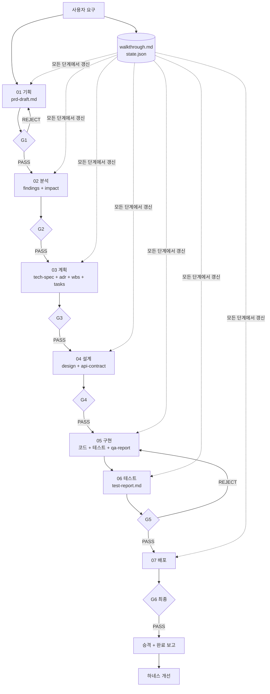

# SDLC Orchestrator

개발 파이프라인의 모든 에이전트와 스킬을 조율하여 요구사항을 검증된 구현으로
전환하는 통합 스킬.

## 실행 모드

**동일한 파이프라인·게이트·산출물을 세 가지 모드로 돌린다.** 모드는 "무엇을
하는가"가 아니라 **"누가 수행하는가"** 만 바꾼다. 토큰 예산에 맞춰 선택한다.

| 모드 | 위임 범위 | 서브에이전트 |
|------|----------|-------------|
| `skill` (경량) | 없음 — 메인 세션이 역할을 순차 전환 | 0 |
| `balanced` (균형·**기본**) | 게이트 리뷰 + 통합 QA만 | 작업당 3~7 |
| `agent` (전체) | 분석·구현은 팀, 나머지는 서브에이전트 | 작업당 12~25 |

### 단계별 수행 주체

| 단계 | `skill` | `balanced` | `agent` |
|------|---------|-----------|---------|
| 01 기획 | 메인 | 메인 | 메인 (사용자 대화 필수) |
| 02 분석 | 메인 (역할 전환 + 교차 검토) | 메인 (동일) | **팀** |
| 03 계획 | 메인 (역할 전환) | 메인 (동일) | 서브 ×2 순차 |
| 04 설계 | 메인 | 메인 | 서브 ×1 |
| 05 구현 | 메인 (Task 순차) | 메인 (Task 순차) | **팀** |
| 05 QA | 메인 (별도 턴) | **서브 ×N** | 팀 내 QA |
| 06 테스트 | 메인 | 메인 | 서브 ×1 |
| **게이트** | 메인 (별도 턴, 파일만) | **서브 ×1** | 서브 ×1~2 |
| 07 배포 | 메인 | 메인 | 서브 ×1 |

**모드와 무관하게 산출물 경로·형식·게이트 기준은 완전히 동일하다.**
모드는 토큰 예산 조절 수단이지 품질 기준의 완화 수단이 아니다.

> 상세 정의·선택 기준·모드별 품질 보정: `harness/execution-modes.md`
> Claude Code 외의 도구는 `harness/adapters/generic-agent.md`의 순차 대체 규약을
> 따른다 (`skill` 모드와 동일한 방식).

## 에이전트 구성

| 단계 | 에이전트 | 출력 |
|------|---------|------|
| 01 | `planner-interviewer` | `01_planning/prd-draft.md` |
| 02 | `research-analyst`, `codebase-analyst` | `02_analysis/*.md` |
| 03 | `tech-spec-writer` → `wbs-planner` | `03_plan/tech-spec.md`, `adr/`, `wbs.md`, `tasks.md` |
| 04 | `architect` | `04_design/design.md`, `api-contract.md` |
| 05 | `backend-engineer`, `frontend-web-engineer`, `frontend-app-engineer`, `frontend-desktop-engineer`, `database-engineer`, `network-engineer`, `qa-inspector` | 코드 + `05_implement/*.md` |
| 06 | `test-engineer` | `docs/test/test-report.md` |
| G1~G4, G6 | `doc-reviewer` | `99_gate/gate-*.md` |
| G5, G6 | `code-reviewer` | `99_gate/gate-implement-*.md` |
| 07 | `devops-engineer` | CI/CD 설정 + `08_deploy/cicd-notes.md` |

**05 구현 팀은 필요한 영역만 구성한다.** 백엔드만 있는 프로젝트에 프론트
에이전트를 넣지 않는다. 팀원 상한 6명.

## 워크플로우

### Phase 0: 컨텍스트 확인 (필수 · 최우선)

**어떤 요청이든 여기서 시작한다.** 이 단계를 건너뛰면 진행 중이던 작업을 덮어쓴다.

1. `_workspace/walkthrough.md` 존재 확인
2. 분기:

| 상태 | 판정 | 행동 |
|------|------|------|
| walkthrough 없음 | **초기 실행** | Phase 1로 |
| walkthrough 있음 + 사용자가 이어서/재개 요청 | **재개** | 아래 3~5 수행 |
| walkthrough 있음 + 특정 단계 수정 요청 | **부분 재실행** | 해당 단계 에이전트만 재호출 |
| walkthrough 있음 + 새 요구사항 | **새 작업** | 새 slug로 폴더 생성. 기존은 보존 |
| 같은 slug로 처음부터 다시 | **새 실행** | 기존을 `_workspace/{slug}_{YYYYMMDD_HHMMSS}/`로 이동 후 재생성 |

3. walkthrough의 "현재 작업" 표에서 slug·단계·상태·다음 행동을 읽는다
4. `_workspace/{slug}/state.json`으로 교차 확인한다
5. **산출물 파일의 실제 존재로 완료 지점을 판정한다.** walkthrough가 "완료"라고
   해도 파일이 없으면 미완료다
6. 사용자에게 재개 지점을 보고하고 확인받는다
   - 재개 시 `state.json`의 `execution_mode`를 그대로 이어받는다

상세 절차는 `harness/principles/workspace.md` 4절.

### Phase 0-1: 실행 모드 결정

우선순위 — **사용자 지시 > `harness/config.yml` > 기본값 `balanced`**

1. 사용자 발화에 모드 지시가 있으면 그것을 따른다:

| 발화 | 모드 |
|------|------|
| "가볍게", "토큰 아껴줘", "에이전트 쓰지 마", "스킬 모드로" | `skill` |
| "리뷰는 따로 받고 싶어" | `balanced` |
| "제대로 돌려줘", "에이전트 다 써서", "병렬로", "에이전트 모드로" | `agent` |

2. 지시가 없으면 `harness/config.yml`의 `execution_mode`를 읽는다
   - 파일이 없으면 `balanced`
   - 값이 `ask`면 사용자에게 묻는다:

```markdown
실행 모드를 선택해 주세요.

| 모드 | 설명 | 서브에이전트 |
|------|------|-------------|
| skill | 메인 세션이 전부 수행. 토큰 최소 | 0 |
| balanced (권장) | 게이트 리뷰·QA만 위임. 판정 독립성 확보 | 3~7 |
| agent | 분석·구현은 팀. 병렬성 최대 | 12~25 |

작업 규모가 아직 파악되지 않았으므로, 03 계획(WBS) 완료 후 상향/하향을
다시 제안할 수 있습니다.
```

3. 결정된 모드를 `state.json`에 기록한다:
   `{ "execution_mode": "balanced", "mode_source": "config" }`
   (`mode_source`: `config` | `user` | `auto-suggested`)
4. `walkthrough.md`에 모드와 결정 근거를 기록한다

### Phase 1: 준비

1. 요구사항에서 **slug**를 정한다 (kebab-case, 작업 전체를 식별)
2. 작업 유형을 판정하고 **실행 경로를 제안한다**:

| 작업 유형 | 경로 |
|----------|------|
| 신규 기능 개발 | 01~07 전체 |
| 버그 수정 | 02(개발분석) → 05 → 06 → G5 |
| 리팩터링 | 02 → 04 → 05 → 06 → G5 |
| 기존 기능 확장 | 01(간소) → 02 → 03 → 04 → 05 → 06 → G5 |
| 문서화만 | 02 → G2 |
| CI/CD 구축만 | 07 |

   **경로 생략은 사용자 승인을 받는다.** 단, 코드가 변경되면 05의 테스트 요구와
   06 테스트, G5는 생략할 수 없다.

3. `_workspace/{slug}/` 및 하위 단계 폴더를 생성한다
4. 사용자 입력을 `00_input/`에 저장한다
5. `_workspace/walkthrough.md`와 `{slug}/state.json`을 초기화한다

### Phase 2: 01 기획

**실행 모드:** 메인 세션 직접

1. `requirements-interview` 스킬을 따라 사용자에게 질문한다
2. PRD를 `01_planning/prd-draft.md`에 작성한다
3. walkthrough 갱신 → **게이트 G1**

### Phase 3: 02 분석

**`skill` · `balanced`** — 메인 세션이 순차 수행

1. `research-analyst` 역할로 전환 → 기획분석 수행 → **파일로 저장**
2. `codebase-analyst` 역할로 전환 → 개발분석 수행 → **파일로 저장**
3. **교차 검토 라운드 1회** (병렬 협업의 이점을 복원하는 보정 절차):
   - 두 산출물을 함께 읽는다
   - 상충 주장이 있는가 → 출처 병기 + 판단 근거 기록
   - A의 발견이 B의 결론을 바꾸는가 → 해당 산출물 갱신
   - 양쪽 모두 다루지 않은 공백이 있는가 → 추가 조사
   - 결과를 `_workspace/{slug}/02_analysis/_cross-review.md`에 기록
4. walkthrough 갱신 → **게이트 G2**

**`agent`** — 에이전트 팀

1. `TeamCreate(team_name: "analysis-team")` — `research-analyst`, `codebase-analyst`
   (둘 다 `model: "opus"`)
2. `TaskCreate`로 각자의 조사 항목을 등록한다
3. 팀원 간 통신 규칙을 프롬프트에 명시:
   - `codebase-analyst`가 기술 제약을 발견하면 → `research-analyst`에게 전달
   - `research-analyst`가 외부 표준·규제를 발견하면 → `codebase-analyst`에게 전달
   - PRD를 무효화하는 발견은 즉시 리더에게
4. 완료 후 `TeamDelete`
5. walkthrough 갱신 → **게이트 G2**

### Phase 4: 03 계획

**`skill` · `balanced`** — 역할 전환하여 순차 수행
**`agent`** — 서브 에이전트 ×2 순차 호출

1. `tech-spec-writer` → Tech Spec + ADR
2. **ADR을 사용자에게 보고하고 승인을 받는다.** 승인 없이 진행하지 않는다
3. `wbs-planner` → WBS + CPM + Task 목록 + **병렬 라운드**
4. **모드 재평가** — WBS 산출로 규모가 확정되었으므로 상향/하향을 제안한다
   (`config.yml`의 `auto_suggest_mode: true`일 때):

| 조건 | 제안 |
|------|------|
| Task ≥ 15 **또는** 필요 역할 ≥ 3 **또는** 병렬 라운드 ≥ 3 | `agent` 상향 |
| Task ≤ 5 이고 필요 역할 = 1 | `skill` 하향 |

   **자동 전환하지 않고 사용자에게 묻는다.** 승인 시 `state.json`의
   `execution_mode`와 `mode_source: "auto-suggested"`를 갱신하고 walkthrough에 기록한다.

5. walkthrough 갱신 → **게이트 G3**

### Phase 5: 04 설계

**`skill` · `balanced`** — 메인 세션이 `architect` 역할로 수행
**`agent`** — 서브 에이전트 ×1

1. 설계서 + 경계면 계약 + 다이어그램 산출
2. walkthrough 갱신 → **게이트 G4**

### Phase 6: 05 구현 + 06 테스트

**`skill`** — 메인 세션이 Task를 순차 수행

1. `tasks.md`의 **병렬 라운드 순서**대로 Task를 진행한다
2. 각 Task마다 해당 영역 역할로 전환하고 `implementation-playbook`의
   **해당 영역 reference만** 로드한다
3. 경계면을 공유하는 Task는 **연속 배치**한다 (계약이 컨텍스트에 살아 있을 때 처리)
4. 계약 확정·변경 시 `_workspace/{slug}/05_implement/_messages.md`에 기록하고,
   영향받는 Task 착수 전 반드시 읽는다
5. QA는 모듈 완성 직후 **별도 턴**에서 수행한다 —
   계약 문서 → 생산자 → 소비자 순으로 읽고 같은 응답에서 대조한다
6. `test-engineer` 역할로 전환 → `docs/test/test-report.md`
7. walkthrough 갱신 → **게이트 G5**

**`balanced`** — 구현은 메인, QA만 위임

1~4는 `skill`과 동일. 단:
5. **각 모듈 완성 직후** `qa-inspector` 서브 에이전트를 호출하여 해당 경계면을
   검증한다 (`model: "opus"`). 전체 완성을 기다리지 않는다
6. QA 결함은 즉시 수정한 뒤 다음 Task로 넘어간다
7. `test-engineer` 역할로 전환 → 리포트 → **게이트 G5**

**`agent`** — 에이전트 팀

1. `tasks.md`에서 **실제 필요한 영역**을 판정하여 팀원을 정한다
2. `TeamCreate(team_name: "impl-team")` — 필요 영역 에이전트 + `network-engineer`
   + `qa-inspector` (전원 `model: "opus"`, 상한 6명)
3. `TaskCreate`로 Task를 등록한다. `depends_on`에 WBS 의존 관계를 반영한다
4. 통신 규칙을 프롬프트에 명시:
   - `network-engineer`가 계약 확정 시 생산자·소비자 **양쪽에 동시 통보**
   - `qa-inspector`는 **각 모듈 완성 직후** 경계면을 검증한다 (전체 완성 대기 금지)
   - QA 결함은 관련 에이전트 **전원**에게 파일:라인 + 정본 + 수정 방법과 함께
5. 모든 Task 완료 후 `TeamDelete`
6. `test-engineer` 서브 에이전트 호출 → `docs/test/test-report.md`
7. walkthrough 갱신 → **게이트 G5**

### Phase 7: 07 배포

**`skill` · `balanced`** — 메인 세션이 `devops-engineer` 역할로 수행
**`agent`** — 서브 에이전트 ×1

**사용자가 배포 조건을 제시하지 않았으면 이 단계를 건너뛴다.**
임의로 플랫폼을 선택하지 않는다.

1. 배포 조건을 사용자에게 확인한다 (`cicd-setup` 스킬의 확인 항목)
2. CI/CD 설정 산출
3. walkthrough 갱신

### Phase 8: 최종 리뷰 (G6)

**`skill`** — 메인 세션이 별도 턴에서 `doc-reviewer` → `code-reviewer` 순차 수행
**`balanced` · `agent`** — 서브 에이전트 2개 병렬 호출

**전 단계 일관성**을 검증한다.

- PRD 요구사항 → Task → 구현의 추적이 끊기지 않는가
- 설계서의 경계면 계약이 코드에서 지켜지는가
- ADR 결정이 반영되었는가
- 테스트 리포트가 최신 코드 기준인가

미충족 시 해당 단계로 롤백한다.

### Phase 9: 승격 및 마무리

1. **문서 승격 제안** — `_workspace/` 산출물 중 승격 후보를 선별하여
   사용자에게 제시하고 승인을 받는다 (`harness/principles/documentation.md` 5절).
   **자동 승격 금지**
2. 승인된 문서를 `docs/template/`의 형식으로 정리하여 `/docs/` 하위에 배치한다
3. 완료 보고서를 `docs/report/completion-{slug}.md`에 작성한다
4. **하네스 개선 도출** — Phase 10
5. `_workspace/`는 보존한다 (삭제 금지)

### Phase 10: 하네스 개선 도출

이번 실행에서 관찰된 **프로세스 자체의 문제**를 도출한다. 결과물 개선이 아니다.

수집 신호:

| 신호 | 시사점 |
|------|--------|
| 특정 게이트에서 반복 반려 | 해당 단계 스킬의 기준이 불명확 |
| 에이전트가 스킬 없이 즉흥 작업 | 스킬 누락 또는 트리거 실패 |
| 사용자가 같은 지적을 2회 이상 | 원칙·스킬에 미반영 |
| 단계 간 산출물 형식 불일치 | 템플릿 결함 |
| 예상보다 오래 걸린 단계 | 분해 또는 병렬화 필요 |
| 사용자가 오케스트레이터를 우회 | 진입 장벽 또는 신뢰 부족 |

제시 형식은 `harness/pipeline.md` 6절. 승인된 개선은 즉시 반영하고
`CLAUDE.md` 변경 이력에 기록한다.

## 리뷰 게이트 운영

각 단계 종료 후 게이트를 실행한다. 상세 기준은 `.claude/skills/review-gate/SKILL.md`.

**게이트는 모드와 무관하게 반드시 실행한다.** 토큰이 부족하다고 건너뛰지 않는다.

| 모드 | 리뷰어 수행 방식 |
|------|----------------|
| `skill` | 메인 세션이 **별도 턴**에서 수행. ① 산출물 **파일만** 읽고 생성 과정의 추론 참조 금지 ② 체크리스트 **항목별 명시 판정** ③ **지적 표를 먼저 쓰고 판정 선언** |
| `balanced` · `agent` | 리뷰어를 **서브 에이전트로** 호출 (생성자와 분리, `model: "opus"`) |

1. 위 표에 따라 리뷰어를 수행시킨다
2. 판정을 `99_gate/gate-{stage}-r{N}.md`에 기록한다
3. 판정 처리:

| 판정 | 행동 |
|------|------|
| PASS | 다음 단계로. walkthrough·state.json 갱신 |
| REJECT | **롤백 대상 단계**로 되돌린다 (직전 단계가 아닐 수 있다). 지적 사항을 해당 에이전트에게 전달하고 재작업 |

4. **같은 게이트 3회 연속 REJECT 시** 자동 재작업을 중단하고 사용자에게 보고한다:
   반복 지적 내용, 추정 근본 원인, 선택지(상위 롤백 / 예외 승인 / 기준 조정)

5. 롤백 시 하위 단계 산출물은 **삭제하지 않고** `state.json`에서 `pending`으로 되돌린다

## 데이터 흐름



모든 단계는 `_workspace/{slug}/` 하위 파일로 산출물을 주고받는다.
컨텍스트로만 전달하지 않는다 — 세션이 끊기면 유실된다.

## 상태 기록 규칙

`walkthrough.md`와 `state.json`은 다음 순간마다 **예외 없이** 갱신한다:

1. 단계 시작 직전 / 완료 직후
2. 게이트 판정 직후 (통과·반려 모두)
3. 사용자 결정이 필요한 항목 발생 시
4. 승격 승인 직후
5. **에러로 중단될 때 — 중단 사유와 재개 지점을 기록**

형식은 `harness/principles/workspace.md` 2절.

## 에러 핸들링

| 상황 | 전략 |
|------|------|
| 팀원·서브에이전트 1명 실패 | 상태 확인 → 1회 재시작. 재실패 시 재할당하거나 누락 명시 후 진행 |
| 팀원 과반 실패 (`agent`) | 진행 중단. 사용자에게 보고하고 계속 여부 확인 |
| 서브에이전트 반복 실패 (`balanced`) | **`skill` 모드로 하향하여 메인이 수행**하고, 판정 독립성 보정 절차를 적용한다. 하향 사실을 walkthrough에 기록 |
| `skill` 모드에서 컨텍스트 압박 | 산출물을 파일로 저장하고 요약만 유지. 이전 단계 전문을 컨텍스트에 남기지 않는다 |
| 토큰 예산 소진 임박 | 게이트를 건너뛰지 않는다. **모드를 하향하거나 작업 범위를 줄이되 기준은 유지**한다. 사용자에게 보고 |
| 에이전트 산출물 누락 | 해당 단계를 미완료로 처리. 게이트에 진입시키지 않는다 |
| 게이트 3회 반려 | 자동 재작업 중단, 사용자 보고 (근본 원인 + 선택지) |
| 사용자 응답 불가 (기획 단계) | 미결정 항목을 명시한 PRD를 산출하고 그 목록을 보고. 추측으로 채우지 않는다 |
| ADR 승인 미획득 | 04 설계로 진행하지 않는다 |
| 테스트 실행 불가 | 미실행으로 리포트에 명시. **PASS로 판정하지 않는다** |
| 배포 조건 미제시 | 07 단계를 건너뛰고 그 사실을 보고 |
| 세션 중단 | walkthrough 기록으로 재개. Phase 0의 재개 절차 |
| 팀원 간 데이터 충돌 | 삭제하지 않고 출처 병기 → `network-engineer` 또는 `architect`가 정본 판정 |

## 테스트 시나리오

### 정상 흐름

1. 사용자: "사용자 로그인 기능 만들어줘"
2. Phase 0 — walkthrough 없음 → 초기 실행
3. Phase 1 — slug `user-auth`, 신규 기능 경로(01~07) 제안 → 승인
4. Phase 2 — 인터뷰 2라운드 → PRD 작성 → G1 PASS
5. Phase 3 — 분석 팀 2명 → G2 PASS
6. Phase 4 — Tech Spec + ADR 2건 → 사용자 승인 → WBS + Task 8개 → G3 PASS
7. Phase 5 — 설계서 + 계약 + 다이어그램 4종 → G4 PASS
8. Phase 6 — 구현 팀 4명(backend, frontend-web, database, network) + QA
   → 테스트 실행 → G5 PASS
9. Phase 7 — 배포 조건 미제시 → 건너뜀
10. Phase 8 — G6 PASS
11. Phase 9 — 승격 후보 5건 제시 → 4건 승인 → `/docs` 배치
12. Phase 10 — 개선 제안 2건 제시

예상 결과: `docs/prd/`, `docs/plan/`, `docs/design/`, `docs/test/test-report.md`,
`docs/report/completion-user-auth.md` 생성 + 코드·테스트 구현

### 에러 흐름 — 게이트 반복 반려

1. Phase 5 완료 후 G4 실행 → REJECT (BLOCKER: 경계면 계약 중 에러 형태 미확정)
2. `architect` 재호출, 지적 항목만 수정 → G4 재실행 → REJECT (같은 항목)
3. 3회차 REJECT → 자동 재작업 중단
4. 사용자에게 보고: "G4가 3회 반려. 반복 지적은 '에러 형태 미확정'.
   추정 원인 — Tech Spec에 에러 정책이 정의되지 않음(상위 단계 결함).
   선택지: ①03 계획으로 롤백 ②예외 승인 ③기준 조정"
5. 사용자가 ①선택 → 03으로 롤백, `state.json`의 04를 `pending`으로 되돌림
6. walkthrough에 롤백 사유와 영향 범위 기록

### 에러 흐름 — 세션 중단 후 재개

1. Phase 6 구현 중 세션 종료. walkthrough에 "05_implement / in_progress /
   다음 행동: T5 리포지토리 구현" 기록됨
2. 새 세션에서 사용자: "이어서 해줘"
3. Phase 0 — walkthrough 발견 → 재개 판정
4. `state.json` 교차 확인 + `05_implement/` 산출물로 실제 완료 지점 판정
   (T4까지 완료, T5 미착수)
5. 사용자에게 재개 지점 보고 → 승인
6. 구현 팀을 T5부터 재구성하여 진행
