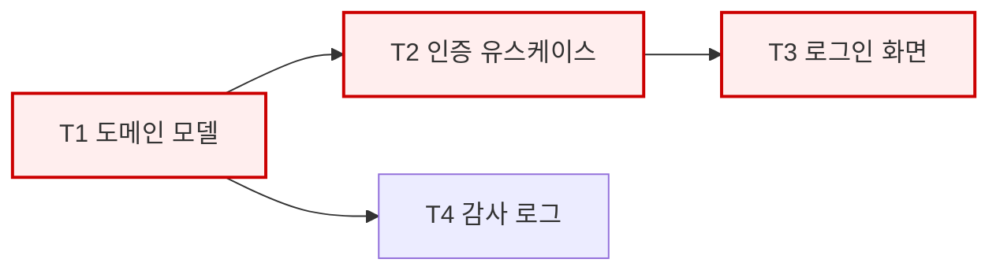

# WBS & CPM Planning — 작업 분해와 임계 경로

## 목적

기술 명세를 **실행 가능한 작업 단위**로 분해하고, 의존 관계로부터 임계 경로와
병렬 가능 구간을 산출한다.

## 원칙

- **WBS의 모든 리프는 Task가 된다.** 리프인데 Task가 아니면 분해가 잘못된 것이다.
- **100% 규칙:** 하위 작업의 합 = 상위 작업의 전부. 빠진 것도 범위 밖 것도 없다.
- **실제 기술적 의존만 적는다.** "순서상 자연스러워서"는 의존이 아니다.
  가짜 의존은 병렬 기회를 죽이고 일정을 늘린다.
- **추정은 범위로 한다.** 단일 값은 반드시 틀린다.

## 절차

### 1. WBS 분해

Tech Spec의 기능 명세를 **결과물(deliverable) 기준**으로 분해한다.
활동(activity) 기준으로 분해하면("설계한다", "구현한다") 완료 판정이 모호해진다.

```
1. 사용자 인증
   1.1 사용자 도메인 모델
   1.2 인증 유스케이스
   1.3 세션 저장소
   1.4 인증 API 엔드포인트
   1.5 로그인 화면
   1.6 아키텍처 검증 테스트
```

분해 중단 기준: 리프가 **PR 하나 크기**가 되면 멈춘다 (2절).

### 2. Task 크기 판정

> **하나의 Task = 하나의 PR = 리뷰 가능한 한 덩어리**

| 판정 | 기준 |
|------|------|
| **너무 큼 — 분해** | 변경 파일 15개 초과 예상 / 서로 다른 계층 3개 이상 동시 변경 / 목적을 한 문장으로 못 말함 / 리뷰어가 30분 안에 못 읽음 |
| **적정** | 하나의 목적, 하나의 수직 슬라이스 또는 하나의 계층, 테스트 포함, 독립 머지 가능 |
| **너무 작음 — 병합** | 단독 머지 시 아무 동작도 안 함 / 리뷰할 것이 사실상 없음 |

**수직 슬라이스 우선.** 가능하면 "도메인+유스케이스+어댑터+테스트"를 한 Task로
묶어 동작하는 단위를 만든다. 계층별로 쪼개면(도메인 전부 → 유스케이스 전부)
마지막까지 아무것도 동작하지 않아 리스크가 뒤로 몰린다.

**모든 Task는 테스트를 포함한다.** "테스트 작성"을 별도 Task로 만들지 않는다.
예외: 아키텍처 검증 테스트 도입, E2E 환경 구축은 인프라 성격이므로 별도 Task.

### 3. 의존 관계 정의

각 Task에 대해 자문한다: *"이것을 시작하려면 반드시 완료되어 있어야 하는 것은?"*

| 의존이다 | 의존이 아니다 |
|---------|-------------|
| B가 A의 산출물(타입·인터페이스·테이블)을 참조한다 | A를 먼저 하는 게 자연스럽다 |
| B가 A의 계약 확정을 전제로 한다 | 같은 사람이 할 거라서 |
| A 없이 B를 테스트할 수 없다 | A와 B가 같은 기능에 속해서 |

**계약이 확정되면 구현은 병렬 가능하다.** API 계약이 정해지면 백엔드 구현과
프론트 구현은 서로 의존하지 않는다 — 이 점을 활용하지 못하면 파이프라인이
불필요하게 직렬화된다.

의존 그래프에 **순환이 있으면 분해 오류**다. 항상. 예외 없이.

### 4. 3점 추정

| 값 | 의미 |
|----|------|
| O (낙관) | 모든 것이 잘 풀렸을 때 |
| M (최빈) | 통상적인 경우 |
| P (비관) | 예상 가능한 문제가 발생했을 때 |

기대값 = `(O + 4M + P) / 6`

단위는 프로젝트에 맞게 택하되 일관되게 쓴다 (인시, 인일, 또는 상대 포인트).
**테스트 작성 시간을 포함**하여 추정한다 — 별도로 빼면 항상 누락된다.

### 5. CPM 계산

1. **전진 계산** — 시작부터: `ES = max(선행들의 EF)`, `EF = ES + 기대값`
2. **후진 계산** — 끝부터: `LF = min(후행들의 LS)`, `LS = LF - 기대값`
3. **여유** `Float = LS - ES`
4. **Float = 0인 경로가 임계 경로**

| ID | Task | 선행 | O | M | P | 기대 | ES | EF | LS | LF | Float | 임계 |
|----|------|------|---|---|---|------|----|----|----|----|-------|------|
| T1 | 사용자 도메인 모델 | - | 2 | 3 | 6 | 3.3 | 0 | 3.3 | 0 | 3.3 | 0 | ★ |
| T2 | 인증 유스케이스 | T1 | 3 | 5 | 9 | 5.3 | 3.3 | 8.6 | 3.3 | 8.6 | 0 | ★ |
| T3 | 로그인 화면 | T2 | 2 | 4 | 8 | 4.3 | 8.6 | 12.9 | 8.6 | 12.9 | 0 | ★ |
| T4 | 감사 로그 | T1 | 1 | 2 | 4 | 2.2 | 3.3 | 5.5 | 10.7 | 12.9 | 7.4 | |

**임계 경로의 의미를 명시한다:** 임계 Task가 1 지연되면 전체가 1 지연된다.
Float가 있는 Task는 그만큼 늦춰도 전체 일정에 영향이 없다.

다이어그램:



붉은 노드가 임계 경로다. 지연이 곧 전체 지연이다.

### 6. 병렬 라운드 산출

동시 착수 가능한 Task 묶음을 산출한다. **구현 팀 구성의 근거**가 된다.

| 라운드 | 동시 착수 가능 | 필요 역할 |
|--------|--------------|----------|
| 1 | T1 | backend-engineer |
| 2 | T2, T4 | backend-engineer |
| 3 | T3, T5 | frontend-web-engineer, database-engineer |

라운드에 등장하는 역할의 합집합이 구현 팀원 후보다. **한 번도 등장하지 않는
역할은 팀에 넣지 않는다.**

### 7. Task 명세

각 Task는 **담당이 컨텍스트 없이 착수 가능**해야 한다.

```markdown
### T2 — 인증 유스케이스 구현

- **담당 역할**: backend-engineer
- **선행**: T1
- **목적**: 자격 증명으로 세션을 발급하는 유스케이스를 구현한다
- **범위**: `src/application/auth/` — 유스케이스, 포트 인터페이스
- **범위 밖**: 세션 저장소 구현체(T5), HTTP 컨트롤러(T6)
- **참조**: tech-spec §4.3, ADR-0003, design §4.2
- **완료 조건**:
  - [ ] 유스케이스가 포트 인터페이스에만 의존한다
  - [ ] 성공/실패 경로 단위 테스트 존재
  - [ ] 아키텍처 검증 A2 통과
- **추정**: O=3 M=5 P=9
```

**범위 밖을 명시하는 것이 범위를 명시하는 것만큼 중요하다.** 없으면 Task가
서로 침범하여 충돌한다.

## 산출물

| 파일 | 내용 |
|------|------|
| `_workspace/{slug}/03_plan/wbs.md` | WBS 트리 + CPM 표 + 다이어그램 + 병렬 라운드 |
| `_workspace/{slug}/03_plan/tasks.md` | Task 명세 목록 (구현 단계의 공유 작업 목록 원본) |

템플릿: `docs/template/wbs.md`

## 리스크 반영

개발분석의 **심각도 높음 + 발생 가능성 확실/높음** 리스크는 대응 Task로 만든다.
완화책이 "이중 읽기 기간 후 전환"이라면 그 자체가 Task다.
리스크를 문서에만 적고 Task로 만들지 않으면 아무도 대응하지 않는다.

## 완료 판정

- [ ] WBS 100% 규칙을 만족한다
- [ ] 모든 리프가 Task가 되었다
- [ ] Task 크기가 PR 단위로 적정하다
- [ ] 각 Task에 목적·범위·범위밖·완료 조건·테스트 요구가 있다
- [ ] 의존 그래프에 순환이 없다
- [ ] CPM 표와 임계 경로가 산출되었다
- [ ] 병렬 라운드와 필요 역할이 산출되었다
- [ ] 심각도 높음 리스크에 대응 Task가 있다
